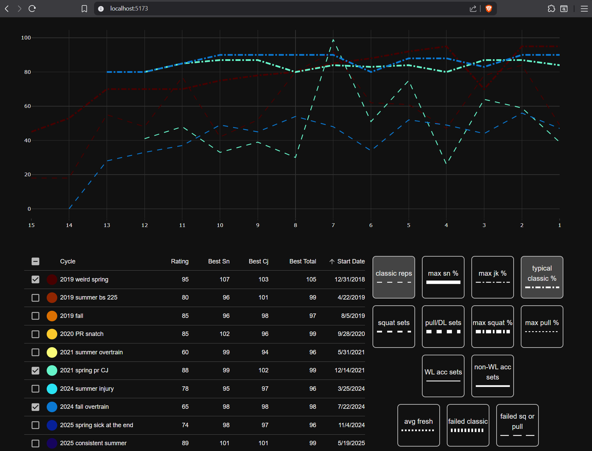

# Weightlifting Visualization

This project aims to assist with qualitative visualization of training data for olympic-style weightlifting. The chart can visualize any combination of training cycles and weekly metrics recorded for those cycles as starting points for deeper investigation into what makes training cycles successful.

## Tech 
The application is a simple stand-alone React app, compiled with a Vite plugin to one html page, for local viewing by me or my coach. The chart made use of Plotly JS, and Material UI was used for some components/theming. 

## Demonstration

Note that cycles (left) and metrics (right) are toggleable. The cycle table is also sortable, allowing for rearranging the cycles. The color scheme stays in the same order, so "red vs blue" cycles can be compared for whichever metadata is the target of the sort. In the image above, sorted by cycle start date, the user can see at a glance how certain metrics differed between early cycles (all red and orange lines) and later ones (blue lines). 

## Development
`npm run dev` to start debugging  
`npm run build` to compile to an html file for 'distribution'  
Run `convertCycles.py` to convert csv training data to a Typescript file